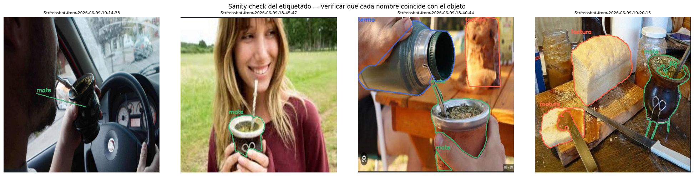
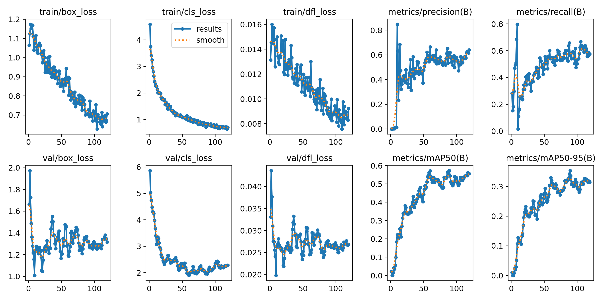
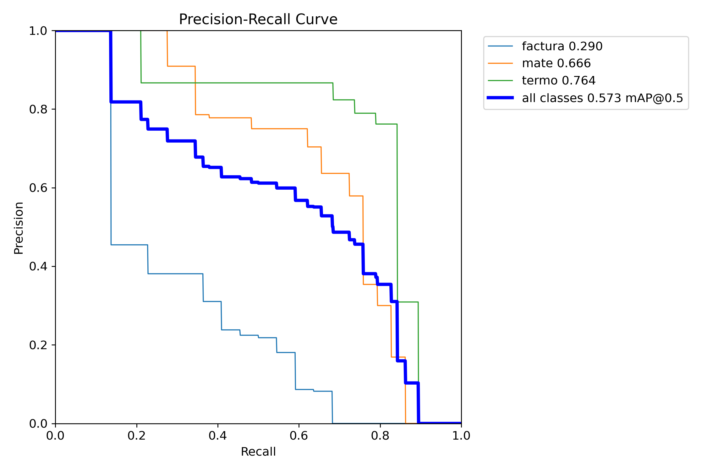
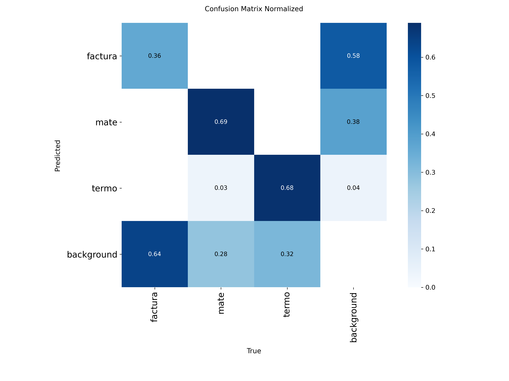
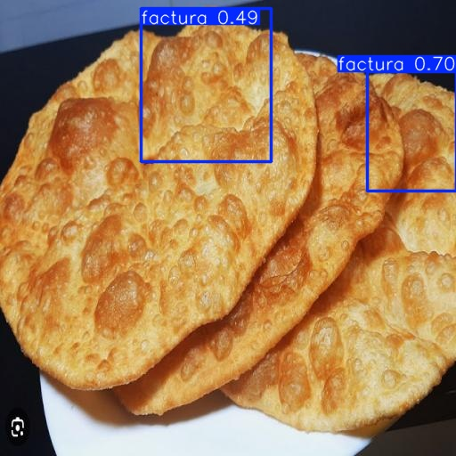
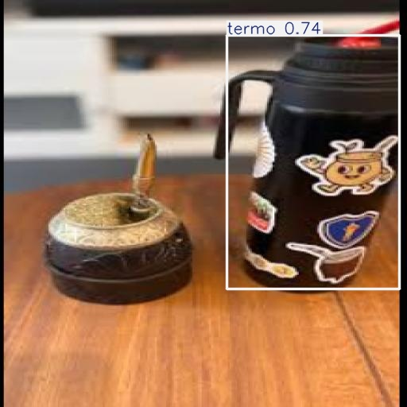
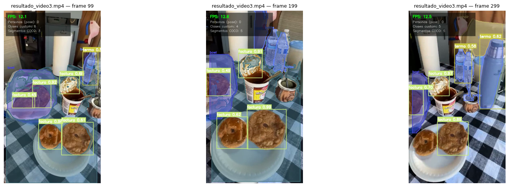
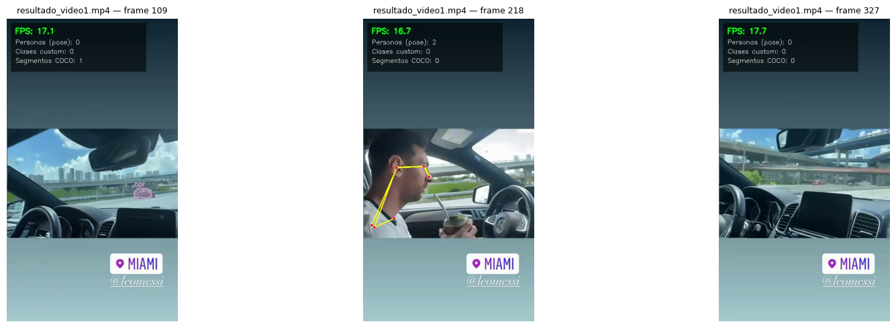
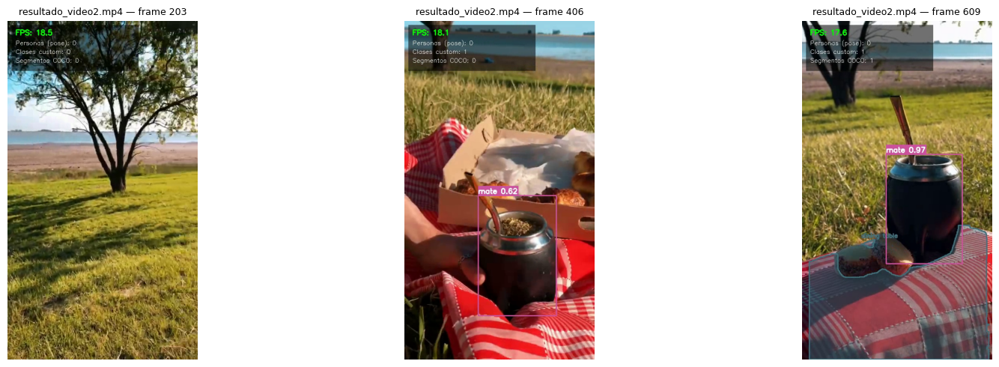

<!--
PRESENTACIÓN FINAL (14 slides, según estructura_presentacion.md)

Cómo exportar:
  - Opción A (Marp): extensión "Marp for VS Code" → Export Slide Deck → PPTX o PDF.
    O por CLI: npx @marp-team/marp-cli presentacion.md --pptx --allow-local-files
  - Opción B: copiar el contenido slide por slide a Google Slides / PowerPoint
    (las imágenes están en presentacion/img/).

Único pendiente manual: en la slide 10 conviene reproducir el video en vivo
(videos/output/resultado_video3.mp4) o convertirlo a GIF si lo prefieren embebido.
-->

# Detección, Segmentación y Pose con YOLO26

## Trabajo Final — Visión por Computadora 2026

**Samuel Kanneman · Federico Ford**

Junio 2026

---

# Introducción

- **YOLO** (*You Only Look Once*): familia de modelos de detección en tiempo real — una sola pasada de red para localizar y clasificar objetos.
- **YOLO26** (Ultralytics, enero 2026): inferencia *end-to-end* sin NMS, más liviano y rápido en CPU/edge, con cabezales para detección, segmentación y pose.
- **Objetivo del trabajo**: integrar las tres tareas en un único pipeline de video.
- **Desafío**: detectar objetos que **no existen en COCO** → hay que entrenar un modelo propio con transfer learning.

---

# Objetivos

1. **Entrenar** YOLO26 con 3 clases personalizadas (no incluidas en las 80 de COCO).
2. **Integrar** en un solo pipeline:
   - Detección custom (modelo propio)
   - Segmentación de instancias COCO (preentrenado)
   - Estimación de pose humana (preentrenado)
3. **Demostrar** el sistema procesando videos reales, con métricas y FPS.

---

# Dataset

| | |
|---|---|
| **Clases (Set A)** | `0: factura` · `1: mate` · `2: termo` |
| **¿Por qué?** | Objetos cotidianos argentinos, ausentes en COCO |
| **Imágenes** | 155 (124 train / 31 valid, split 80/20) |
| **Instancias (train)** | 208 factura · 106 mate · 71 termo |
| **Etiquetado** | Roboflow (polígonos YOLO), licencia CC BY 4.0 |


*Sanity check del etiquetado: polígonos de los labels sobre imágenes de train.*

---

# Configuración del entrenamiento

- **Modelo base**: `yolo26n.pt` (nano) — *transfer learning* desde COCO
- **Épocas**: 150 con *early stopping* (`patience=30`) → cortó en la **119**, mejor época la **89**
- **Batch size**: 16 · **Image size**: 640
- **Optimizador**: AdamW, `lr0 = 0.001`
- **Augmentations**: las default de Ultralytics (mosaic, flips, HSV, etc.)
- **Hardware**: Google Colab (GPU T4) — entrenamiento completo en **~8 minutos**

> También probamos `yolo26s` (small): **overfitteó** con un dataset tan chico (ver slide 12).

---

# Métricas de entrenamiento

| Métrica | Objetivo | Obtenido | |
|---------|----------|----------|---|
| mAP50 (global) | ≥ 0.70 | **0.57** | ⚠️ |
| mAP50 — termo | | **0.76** | ✅ |
| mAP50 — mate | | **0.66** | ~ |
| mAP50 — factura | | **0.29** | ❌ |
| mAP50-95 | ≥ 0.55 | 0.35 | ⚠️ |
| Precision / Recall | ≥ 0.80 / ≥ 0.70 | 0.56 / 0.62 | ⚠️ |

 

---

# Métricas: ¿dónde falla el modelo?



- Casi **no hay confusión entre clases** — el problema es de **detección** (recall): la mayoría de los errores son objetos reales predichos como *background*.
- `factura` concentra el problema: objetos chicos, **agrupados y solapados** (bandejas), con posible etiquetado incompleto.
- El set de validación es chico (31 imágenes, solo 8 con facturas) → métricas con mucha varianza.

---

# Resultados del modelo custom

 

- **Izquierda**: detecta facturas con buena confianza (0.70), pero solo 2 de 4 — el solapamiento penaliza el recall.
- **Derecha**: termo detectado (0.74), pero el mate en primer plano no — ángulos poco representados en train.
- Más ejemplos en `presentacion/img/predicciones_test/` (31 imágenes de validación).

---

# Arquitectura del pipeline de inferencia

```
                    ┌──────────────────────────┐
                    │   Frame del video        │
                    └────────────┬─────────────┘
          ┌──────────────────────┼──────────────────────┐
          ▼                      ▼                      ▼
 ┌─────────────────┐   ┌──────────────────┐   ┌─────────────────┐
 │ yolo26n-seg.pt  │   │ yolo26n-pose.pt  │   │    best.pt      │
 │ Segmentación    │   │ Pose (COCO-17)   │   │ Detección custom│
 │ COCO            │   │                  │   │ factura/mate/   │
 │ (con exclusión  │   │                  │   │ termo           │
 │  de clases)     │   │                  │   │                 │
 └────────┬────────┘   └────────┬─────────┘   └────────┬────────┘
          └──────────────────────┼──────────────────────┘
                                 ▼
                  ┌───────────────────────────┐
                  │  utils.annotate_frame()   │
                  │  máscaras + skeletons +   │
                  │  bboxes + overlay (FPS,   │
                  │  conteos)                 │
                  └────────────┬──────────────┘
                               ▼
                  videos/output/resultado_*.mp4
```

---

# Lógica de exclusión

**Cada objeto es responsabilidad de exactamente un modelo:**

- `person` → la dibuja el modelo de **pose** (skeleton); se excluye de la segmentación para no duplicar.
- Clases custom → las dibuja el detector **custom** con bbox + confianza.
- **Pasó en la práctica**: COCO veía las facturas como `donut`/`cake` y el mate como `cup`, superponiendo máscaras sobre nuestras cajas → agregamos esas clases a la lista de exclusión (`EXTRA_EXCLUDE`).

**Resultado**: frame limpio, sin anotaciones contradictorias.

---

# Demostración: video procesado

Videos completos en `videos/output/` (reproducir `resultado_video3.mp4` en vivo):



- 🟨 Bounding boxes con confianza sobre factura / mate / termo (modelo custom)
- 🟦 Máscaras de segmentación COCO (`bottle`, `bowl`, `dining table`)
- 📊 Overlay con FPS y conteos por categoría

---

# Ejemplos de frames


*video1: pose en acción — skeleton sobre el conductor tomando mate.*


*video2: mate y picnic al aire libre — detección custom + segmentación COCO.*

---

# Dificultades encontradas

- **Orden de clases**: el export de Roboflow definía `0: bolleria, 1: mate, 2: termo`, distinto a la config inicial del repo → se corrigió `data.yaml` respetando los índices (si no, las clases quedaban cruzadas).
- **Formato de labels**: Roboflow exportó polígonos (segmentación) → Ultralytics los convierte automáticamente para detección.
- **Selección de modelo** (3 experimentos):

| Run | Modelo | Épocas | mAP50 | Precision | Recall |
|-----|--------|--------|-------|-----------|--------|
| v1 | yolo26n | 80 | 0.59 | 0.62 | 0.53 |
| v2 | yolo26s | 150 (stop en 78) | 0.53 | 0.73 | 0.42 |
| **v3 final** | **yolo26n** | **150 (stop en 119)** | **0.57** | 0.56 | **0.62** |

→ con 124 imágenes, el modelo **small overfittea**; el nano generaliza mejor.

- **Clase difícil**: `factura` (0.29) — objetos chicos y agrupados, aun siendo la clase con más instancias.

---

# Conclusiones

- ✅ Pipeline funcional que integra **3 tareas de visión** en un solo paso de video, a **12-17 FPS** en una T4 (objetivo ≥ 5, ideal ≥ 15).
- ✅ **Transfer learning** permite un detector útil con solo ~150 imágenes — pero el techo lo pone el **dataset**, no el modelo (más capacidad = overfit).
- ✅ La **calidad del etiquetado** (orden de clases, formato, completitud en objetos agrupados) importa tanto como la arquitectura.

**Líneas futuras**: más datos y mejor etiquetado de facturas · tracking entre frames (ByteTrack) · export a ONNX/TensorRT para más FPS · más clases custom.

---

<!-- _class: lead -->

# ¡Muchas gracias!

## ¿Preguntas?

Repo: `github.com/samuelkanneman/TPF---Vision-por-Computadora-2026`
